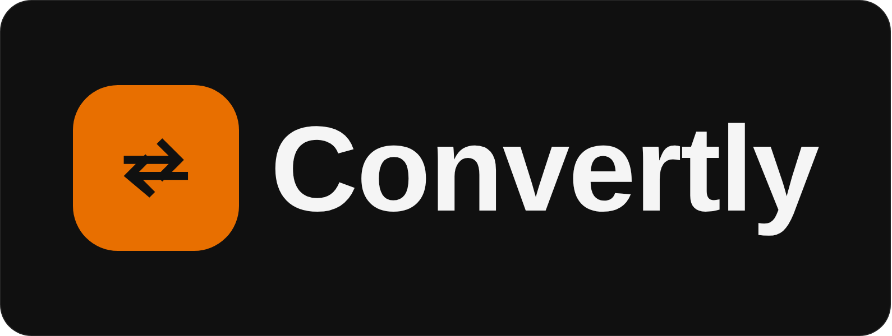

<p align="center">
  
</p>

# Convertly

**[English](README.md)** | 简体中文

一款完全在你浏览器标签页内运行的文件转换、矢量化和压缩工具。你处理的文件绝不会
上传到服务器，也无需注册账号，这不是一句营销口号，转换文件时你可以打开浏览器
的网络面板，亲眼确认没有任何上传请求被发出。

在线体验：[convertly0.vercel.app](https://convertly0.vercel.app)（自定义域名申请中，
详见下方[项目状态](#项目状态)）
源码：本仓库，[github.com/Ememzyvisuals/Convertly](https://github.com/Ememzyvisuals/Convertly)

开发者：**Ememzyvisuals**，[个人主页](https://ememzyvisuals.vercel.app) ·
[X](https://x.com/Ememzyvisuals) · [GitHub](https://github.com/Ememzyvisuals) ·
[TikTok](https://www.tiktok.com/@Ememzyvisuals)

如果这个项目对你有帮助，最好的感谢方式是在
[X/Twitter](https://x.com/Ememzyvisuals) 上留言，应用内页脚的“Support”按钮和仓库
自己的 Sponsor 标签也都指向这里。

视觉设计系统（近黑色调色板、橙色强调色、胶囊形按钮、系统字体栈）改编自
Syed Subhan（[@Subhan-code](https://github.com/Subhan-code/Amicro--Micro-transitions-)）
的 [Amicro](https://amicro.vercel.app)。

---

## 目录

- [为什么做这个](#为什么做这个)
- [目前已经做好的功能](#目前已经做好的功能)
- [路线图，接下来要做的](#路线图接下来要做的)
- [项目状态](#项目状态)
- [用户快速上手](#用户快速上手)
- [部署你自己的副本](#部署你自己的副本)
- [本地开发](#本地开发)
- [项目结构](#项目结构)
- [如何添加一个新工具（面向贡献者）](#如何添加一个新工具面向贡献者)
- [设计系统与约定](#设计系统与约定)
- [已知限制（设计使然）](#已知限制设计使然)
- [参与贡献](#参与贡献)
- [许可证](#许可证)

---

## 为什么做这个

大多数在线文件转换工具，CloudConvert、Zamzar、Convertio、iLovePDF、Smallpdf，底层
原理其实都一样：你的文件被上传到它们的服务器，在那里完成转换，再传回来。即便是
那些宣传“传输加密”的工具也是如此，文件仍然要经过一台你无法掌控的机器，哪怕只是
短暂经过。

Convertly 的做法不一样：每个工具都是在你自己的浏览器里运行的真实代码，使用
Canvas API、真实编码器的 WebAssembly 编译版本（FFmpeg），以及真正的浏览器内库
（一个真实的矢量描摹引擎、一个真实的分割模型），而不是一个悄悄把文件传到别处的
瘦客户端。这一点对人们最想保护的那类文件尤其重要：合同、身份证件、财务报表，
任何他们不愿意哪怕几秒钟也交给陌生服务器的东西。

Convertly 的第二个不同之处：它不会把真正的功能锁在账号或订阅后面。为了防止滥用，
它设有一个本地的、按浏览器计算的软性每日计数器（见[已知限制](#已知限制设计使然)），
而不是付费墙。

## 目前已经做好的功能

Convertly 是一个专注、单一的工作台：快速、单一用途的转换工具，按类别组织
（图片与视频、PDF、音频、压缩包），无需注册，拖入文件即可得到结果。下面列出的
每一项都是真实可用的，今天就能用，不是效果图。

**图片与视频**
- **格式转换**：PNG、JPEG、WebP、AVIF（取决于访问者浏览器是否支持该编码），通过
  Canvas API 实现。PNG 为无损转换，其余格式可调节质量。
- **去除背景**：一个真实的浏览器内分割模型
  （[`@imgly/background-removal`](https://github.com/imgly/background-removal-js)）。
  该模型（视版本大小约 15 到 40 MB）在你第一次使用这个功能时从 IMG.LY 的 CDN
  拉取，这是整个应用中唯一不是完全自包含的部分，界面会在下载任何内容之前明确
  提示这一点。
- **矢量化**：通过
  [`imagetracerjs`](https://github.com/jankovicsandras/imagetracerjs) 实现的真实
  位图转矢量描摹，只提供一个“细节程度”控制项（简单、均衡、精细），而不是一堆
  滑块。
- **压缩图片**：canvas 重新编码，带质量滑块和可选的缩放。
- **压缩视频**：编译为 WebAssembly 的真实 FFmpeg 构建
  （[`@ffmpeg/ffmpeg`](https://github.com/ffmpegwasm/ffmpeg.wasm)），完全在本标签
  页内运行。编解码器（H.264/VP9）、CRF 质量、分辨率上限、编码速度预设、音频比特率
  都是真实生效的控制项，不是摆设。
- **视频工具**：精确裁剪到起止时间点，将片段转换为真正基于调色板的 GIF（两遍
  `palettegen`/`paletteuse`，而不是 FFmpeg 默认那种浑浊效果），将视频的音轨提取为
  独立的 MP3，以及用另一段音频或另一个视频的音轨完整替换视频的声音（原声会被
  丢弃，结果时长取两者中较短的一个）。使用与“压缩视频”相同的 FFmpeg 引擎。

**PDF**
- **图片转 PDF**：将任意数量的 PNG/JPEG/WebP/BMP 图片合并为一个 PDF，可选择
  居中排在 A4 页面上，或每张图片按其原始尺寸单独成页。
- **PDF 转图片**：通过 [`pdf.js`](https://github.com/mozilla/pdf.js) 将 PDF 的每一页
  渲染为真实的 PNG，可选择质量倍数，单页直接下载，多页则打包为 ZIP。
- **合并 PDF**：将两个或多个 PDF 按你排列的顺序合并为一个文件。
- **拆分 PDF**：将 PDF 拆分为每页一个的单页 PDF，打包在一起。
- 以上功能通过 [`pdf-lib`](https://github.com/Hopding/pdf-lib)（构建/合并）和
  `pdf.js`（渲染）实现，两者都在本地运行，使用自托管的 worker（不依赖 CDN）。

**音频**
- **转换**：MP3、WAV、FLAC、OGG、M4A，支持真实的比特率、采样率和单声道/立体声
  控制。
- **裁剪**：根据文件真实的时长，裁剪到指定的起止范围。
- **响度归一化**：EBU R128 响度归一化（`loudnorm`，-16 LUFS），一个真实的滤镜，
  而不是伪装成滤镜的音量滑块。
- 与视频共用同一个 FFmpeg WebAssembly 引擎，因此即使两者都用到，每个标签页也
  只会加载一次。

**压缩包**
- **创建压缩包**：任意数量、任意类型的文件，DEFLATE 压缩，通过
  [`JSZip`](https://github.com/Stuk/jszip) 实现。
- **解压压缩包**：读取真实内容，并可单独下载其中每一个文件。

**贯穿每个工具的功能**
- **处理前后对比预览**：原始文件与处理结果并排展示（音频则是一个真实可播放的
  结果），下载操作就在结果正下方。
- **需要时支持多文件上传**（PDF 合并、图片转 PDF、创建压缩包），带一个可重新
  排序或删减的有序列表，运行前都可以调整。
- **本地每日使用计数器**：一个软性的、按浏览器计算的限制（每天 100 次，显示在
  每个工具的运行按钮下方），存储在 `localStorage` 中。这相当于客户端版本的
  “网站如何知道你已登录”，而不是真正的服务端防滥用机制（清除站点数据或使用
  隐私窗口都会重置它），界面对此也很坦诚，而不是假装它是别的东西。
- **浅色和深色模式**，默认深色，按浏览器记忆偏好。
- **落地页、工具中心，以及每个工具各自的独立页面**：首页是产品介绍，一个
  “立即开始”按钮（以及页头的“打开工具”）会带你进入工具中心页面，这里把每个
  模块都列成一张卡片。每张卡片会打开该工具自己的页面
  （`#/tools/<id>`，例如 `#/tools/merge-pdf`），因此每个工具都可以直接通过链接
  访问、刷新后依然停留在原页面，并且支持浏览器的前进/后退按钮。

每个结果页面显示的都是**真实**的输出体积和处理时间，而不是预先写死的数字。对
某些输入（已经压缩过的图片、很小或很嘈杂的测试文件）来说，“压缩后”的结果体积
甚至可能*比原文件更大*，界面会用琥珀色如实标注出来，而不是隐藏这一点。

## 路线图，接下来要做的

下一步是打造一个**通用转换器**和**通用压缩**工作台，一个“拖入文件，我们检测
格式，你选择输出”的统一入口，放在上面所有工具之前，而不是让用户先自己找对
分类。

除此之外：
- PDF：重新排序、旋转、提取指定页面，以及 PDF 压缩（重新压缩 PDF 内嵌的图片）。
- 带有诚实提示的文档转换：通过真实的客户端管线（编译为 WebAssembly 的 Pandoc
  输出给同样是 WebAssembly 的 Typst 做最终 PDF 渲染）实现 DOCX 转 PDF，以及
  Markdown、RTF、ODT 转换。对普通排版、表格和图片而言效果不错，但明确不承诺
  对复杂原始版式做到像素级还原。PDF 转文本、PDF 转基础可编辑 DOCX（以文本为主，
  不是版式克隆）属于同一档次。
- 持续打磨现有工具的界面和移动端体验，这是目前的重点，而不是开发新功能面。

**明确暂不计划的，以及原因：**
- 完全保真的 DOC/DOCX/PPT/XLS/ODT 转换（原始字体、表格、内嵌对象完全保留）需要
  一个真正的 Office 渲染引擎，比如 LibreOffice。目前唯一存在的 WebAssembly 版本
  压缩后体积约 80 MB，冷启动需要好几秒，其维护者自己都说它不稳定，甚至还不能
  导出为 PDF。为了一个只完成一半的功能而牺牲“快速、轻量、完全本地”的体验并不
  值得，所以这项工作被搁置，直到出现真正可行的客户端方案，或者经过审慎、明确
  沟通的决定，专门为这一个狭窄的功能加一个小型服务端接口。
- 公开的转换 API 是一次真正的架构分叉，而不是一个小功能，它意味着 API 用户的
  文件要在真实服务器上处理，这本身是一个可以和免费浏览器工具并存的正当产品，
  但它需要自己的托管、限流和鉴权方案，因此被当作一个独立的决策来对待，而不是
  悄悄塞进现有版本里。

## 项目状态

项目正在持续扩展中。如果你正在读这段内容来决定是否要 fork、部署或参与贡献，
以下几点值得了解：

- 官方托管副本部署在 Vercel 上，地址是 `convertly0.vercel.app`（`convertly` 这个
  项目名已被占用，所以带了个 `0`）。
- 针对 [js-org/js.org](https://github.com/js-org/js.org) 的一个 pull request 曾
  尝试注册 `convertly.js.org` 作为更友好的自定义域名，指向这个 Vercel 部署，
  但未获通过；目前正在通过另一个免费子域名服务（js.cool）重新申请。
- [目前已经做好的功能](#目前已经做好的功能)下列出的所有工具都已实现并可在线
  使用。只有[路线图](#路线图接下来要做的)里提到的通用转换器/压缩入口和文档
  转换功能还在开发中。

## 用户快速上手

只是想用一下？打开上面的在线链接，点击 **立即开始**，把文件拖进你需要的工具，
下载结果即可。没有注册页面，不会收集你的邮箱。

## 部署你自己的副本

### 方式 A：Netlify，拖拽上传，零配置

本仓库中的 `dist/` 文件夹（如果存在）是一份预构建、可直接部署的副本。如果你是
从一个全新的克隆开始（还没有 `dist/`），先运行 `npm install && npm run build`
生成它。

1. 打开 [app.netlify.com/drop](https://app.netlify.com/drop)
2. 把 **`dist`** 文件夹本身（不是整个仓库，也不是压缩包）拖到页面上
3. Netlify 会立即给你一个 `*.netlify.app` 的在线链接

这条路径不需要环境变量、函数、数据库，也不需要指定构建命令。

### 方式 B：Netlify，连接 Git 仓库

- 构建命令：`npm run build`
- 发布目录：`dist`
- Node 版本：18 或更高（Netlify 在大多数情况下会自动设置；如果没有，添加环境
  变量 `NODE_VERSION=18`）

### 方式 C：Vercel

```bash
npm install -g vercel
cd convertly
vercel --prod
```

Vercel 会自动识别 Vite 项目。如果它明确询问：构建命令是 `npm run build`，输出
目录是 `dist`。

### 方式 D：任意静态托管

由于构建产物只是一个普通的静态站点（HTML、JS、CSS，加上几个按需懒加载的
WebAssembly/模型资源），它可以运行在任何静态文件托管上：GitHub Pages、
Cloudflare Pages、S3 加 CloudFront、一台普通的 nginx 服务器，等等。这个项目里
没有任何需要配置的服务端代码。

## 本地开发

```bash
git clone https://github.com/Ememzyvisuals/Convertly.git
cd Convertly
npm install
npm run dev      # 本地开发服务器，支持热更新，通常是 http://localhost:5173
npm run build    # 先用 tsc 做类型检查，再生成 dist/
npm run preview  # 在本地预览已构建的 dist/，用于最后的检查
```

环境要求：Node.js 18 或更高版本，以及 npm。本地运行不需要任何其他服务、数据库
或 API 密钥，这正是这个项目的初衷。

> **如果你在 Android/Termux 或其他共享存储受限、非 POSIX 的环境下：**
> `npm install` 需要为 `node_modules/.bin` 创建符号链接，在不支持符号链接的
> 文件系统上（尤其是 Android 通过 FUSE 挂载的共享存储）会报
> `EACCES`/`symlink` 错误。请先把项目克隆或复制到该工具自己的原生主目录下
> （例如 Termux 的 `~/`，而不是 `~/storage/downloads/...`），再从那里运行
> `npm install`。

## 项目结构

```
convertly/
├── dist/                 预构建产物，运行 `npm run build` 后出现；这就是你
│                          原样部署的文件夹
├── public/
│   ├── ffmpeg/            FFmpeg WASM 核心，作为静态文件提供，懒加载
│   ├── brand/             吉祥物渲染图：mascot-hero.png/webp（落地页大图，
│   │                       真实 alpha 透明）和 mascot-bust.png/webp（同一张图
│   │                       的裁剪版，用作上传区域插图）
│   ├── logo-banner.png/svg  本 README 顶部的横幅，使用与应用内页头相同的
│   │                         徽标图形和 Fredoka 字体拼合而成
│   └── favicon.svg
├── src/
│   ├── lib/               真正的转换/矢量化/压缩引擎，与框架无关，不含 DOM 代码
│   │   ├── convert.ts       图片格式转换（Canvas API）
│   │   ├── vectorize.ts     位图转 SVG 描摹
│   │   ├── compressImage.ts 图片重新编码/缩放
│   │   ├── compressVideo.ts 基于 FFmpeg 的视频压缩
│   │   ├── videoTools.ts    裁剪、视频转 GIF、提取/替换音频（FFmpeg）
│   │   ├── audioTools.ts    音频格式/比特率/裁剪/归一化转换（FFmpeg）
│   │   ├── ffmpegEngine.ts  共享的 FFmpeg WASM 加载器，整个标签页只加载一次
│   │   ├── pdfTools.ts      图片转 PDF、PDF 转图片、合并、拆分（pdf-lib + pdf.js）
│   │   ├── archiveTools.ts  ZIP 创建/解压（JSZip）
│   │   ├── bgRemoval.ts     背景去除模型的封装
│   │   ├── usageLimit.ts    本地每日使用计数器
│   │   ├── validate.ts      基于文件头字节的类型嗅探（从不信任扩展名）
│   │   └── format.ts        字节数/时长/压缩比的格式化辅助函数
│   ├── ui/                可复用的 DOM 组件，不含业务逻辑
│   │   ├── upload.ts        拖放 + 文件选择上传器，支持单文件和多文件
│   │   ├── controls.ts      分段控件、范围滑块、预估条
│   │   ├── resultPanel.ts   所有工具共用的处理前后对比 + 下载界面
│   │   ├── processPanel.ts  一步步展示的“处理中”界面
│   │   ├── usageBadge.ts    “今日已用 N/100 次”提示条和达到限制后的面板
│   │   ├── themeToggle.ts   浅色/深色模式切换
│   │   ├── socialIcons.ts   页脚用的内联 SVG 品牌图标
│   │   ├── toolIcons.ts     每个工具一个手绘线条图标，用在工具中心的卡片上
│   │   └── dom.ts           不依赖框架构建 DOM 节点的小工具函数 `el(...)`
│   ├── i18n.ts             极简的 i18n 层：英文/中文词典和 `t(key)` 查找函数，
│   │                        覆盖页头、落地页、工具中心、页脚，以及每个工具页面
│   │                        的标题和描述
│   ├── pages/              页面级外壳，不绑定任何单一工具
│   │   ├── toolsHub.ts       “打开工具”索引页：每个模块一张文件夹形状的卡片，
│   │   │                      按类别分组
│   │   └── toolPage.ts       每个独立工具页面所用的外壳（返回链接、标题、
│   │                          描述，然后是该工具自己的主体）
│   ├── tools/              每个工具一个文件，各自导出一个扁平的 `build*Tool()`
│   │   │                    函数，把 `lib/` 里的引擎和共享的 `ui/` 组件连接
│   │   │                    起来；包含多个相关工具的文件（PDF、额外的视频
│   │   │                    工具）为每个工具导出一个独立函数，而不是用内部的
│   │   │                    模式切换捆在一起，因为每个工具都有自己的独立页面
│   │   ├── convertTool.ts      buildConvertFormatTool, buildRemoveBgTool
│   │   ├── vectorizeTool.ts    buildVectorizeTool
│   │   ├── compressTool.ts     buildCompressImageTool, buildCompressVideoTool
│   │   ├── videoExtraTool.ts   buildTrimVideoTool, buildVideoToGifTool,
│   │   │                        buildExtractAudioTool, buildReplaceAudioTool
│   │   ├── pdfTool.ts          buildImagesToPdf, buildPdfToImages, buildMergePdfs,
│   │   │                        buildSplitPdf
│   │   ├── audioTool.ts        buildAudioTool
│   │   └── archiveTool.ts      buildCreateZip, buildExtractZip
│   ├── style.css           完整的设计令牌系统（颜色、间距、圆角、浅/深色主题
│   │                        覆盖）以及每个组件的样式
│   └── main.ts             应用外壳：页头/导航、大图区、页脚、把每个工具 id
│                            映射到其页面的 `TOOL_PAGES` 注册表，以及基于哈希
│                            的路由（落地页/工具中心/单个工具页面）
├── index.html              应用入口，也包含内联的“无闪烁”主题/语言脚本
├── netlify.toml
└── package.json
```

这个项目刻意不使用框架（没有 React、Vue 等），也没有客户端路由库。路由是
`main.ts` 里的一个 `TOOL_PAGES` 注册表（工具 id 对应
`{title, description, build}`），加上一对 `goTo(view)`/`goToTool(id)` 函数，
它们在三个视图容器之间切换，并把 `window.location.hash` 更新为 `""`、
`#/tools` 或 `#/tools/<id>`。一个 `hashchange` 监听器会在每次导航时重新解析
哈希，因此浏览器的前进/后退按钮，以及手动输入的 `#/tools/<id>` 链接都能正常
工作，而不仅仅是应用内部的点击。这是刻意为之的选择，这个应用足够简单，引入
框架只会增加构建复杂度，带来的收益却不多。

## 如何添加一个新工具（面向贡献者）

现有的每个工具都遵循同一种结构，任何新工具（见[路线图](#路线图接下来要做的)）
也应该遵循：

1. **引擎放在 `src/lib/` 里，不包含任何 DOM 代码。** 它接收一个 `File`（或
   类似对象）和选项，做真实的工作（不是占位符），返回一个真实的结果
   （`Blob`、尺寸，或其他相关信息）。这让引擎可以脱离 UI 层被测试和复用。
2. **工具面板放在 `src/tools/` 里，是一个扁平导出的 `build*Tool()` 函数，
   返回一个 `HTMLElement`。** 一个函数只做一件事，没有内部模式切换，因此可以
   直接放到它自己的独立页面上。它会用 `src/ui/controls.ts` 里的共享组件构建
   该工具专属的控件，把它们和引擎连接起来，完成后调用
   `src/ui/resultPanel.ts` 里的 `renderResultPanel(...)`，传入真实的处理前后
   数据，绝不使用伪造的数字。
3. **每个工具在运行前都会检查 `getUsageStatus()`**，如果本地每日限制已达到，
   就显示 `usageLimitReachedPanel()`（见 `src/lib/usageLimit.ts` 和
   `src/ui/usageBadge.ts`）。
4. **每个工具都包含一段诚实、通俗的说明，讲清楚这个操作实际能做到什么、不能
   保证什么**（见传入 `renderResultPanel` 的 `honestyNote` 字段）。如果一个
   新工具存在真实的局限（比如某种文档转换做不到像素级还原），这个局限应该
   写进界面文案里，而不是只写在这份 README 里。
5. **新工具需要在 `src/main.ts` 里添加一个 `TOOL_PAGES` 条目和一张工具中心
   卡片。** 在 `TOOL_PAGES` 注册表里以一个唯一 id 添加
   `{title, description, icon, build}`，然后在 `hubCategories` 对应的类别里
   添加一张匹配的卡片（同样的 id，加上标签/描述和 `src/ui/toolIcons.ts` 里
   的一个工具图标）。正是这一条注册表记录，让这个工具可以通过
   `#/tools/<id>` 访问，无论是从工具中心的卡片，还是直接通过链接。

## 设计系统与约定

- **颜色、间距和形状全部是 CSS 自定义属性**，统一在 `src/style.css` 的
  `:root` 中定义，浅色模式则通过 `:root[data-theme="light"]` 覆盖块实现。
  不要在组件里写死某个十六进制颜色或像素圆角，使用现有的令牌
  （`var(--accent)`、`var(--radius-pill)` 等等），这样两种主题才能始终保持
  正确。
- **按钮是胶囊形（`--radius-pill`），卡片使用 `--radius-md`。** 这不是随意
  决定的，是沿用了这个项目视觉语言所基于的 Amicro 设计系统。
- **边框和弱化文字使用基于透明度的 `rgba()` 值**，而不是纯灰色，同样是沿用
  同一套设计系统。
- **字体自托管**，通过 `@fontsource/outfit` 和 `@fontsource/fredoka`（直接在
  `main.ts` 里引入），而不是从 Google Fonts 的 CDN 加载。这是一次刻意的修复：
  外部字体 CDN 依赖此前曾导致字体在受限/离线的测试环境里悄无声息地渲染失败。
  Outfit 承担正文和界面文案，Fredoka 只用于标题和大号展示文字。
- **任何地方都不使用破折号（em dash）**，无论是代码注释、界面文案还是这份
  README。请用句号或逗号代替。这是这个项目一贯的风格规则，不是一次性要求。
- **绝不使用虚假数据。** 界面上展示的每一个数字（文件体积、处理时间、变化
  百分比）都必须来自一次真实操作的真实测量。如果某个功能暂时无法真正实现，
  它就不会先上线一个假装能用的占位版本。

## 已知限制（设计使然）

- **没有服务端或基于 IP 的使用限制。** 取而代之的是一个本地的、按浏览器
  计算的每日计数器，一个真诚的提醒，而不是真正的防滥用手段。真正的服务端
  限制需要一个持久化的后端，这与本项目优先追求的“拖一个静态文件夹、零配置”
  部署方式相冲突。
- **AVIF 编码**取决于访问者的浏览器是否支持 `canvas.toBlob('image/avif')`。
  Convertly 会检测这一点，在不支持的地方隐藏 AVIF 选项，而不是提供了却让它
  失败。
- **超大视频**在内存受限的设备上（尤其是较旧的手机）可能在 WebAssembly 沙箱
  内耗尽内存。结果是一个诚实的错误提示，而不是一个假结果；要真正提高这个
  上限，需要一个服务端转码管线，这超出了一个无后端构建的范围。
- **背景去除**是唯一会调用第三方服务的功能（IMG.LY 的 CDN，仅用于获取模型
  权重，绝不用于传输用户的文件）。其余一切都完全在本地运行。

## 参与贡献

欢迎提交 issue 和 pull request。开一个 PR 之前，有几点实用的建议：

- 如果你要添加一个新的转换工具，先读一遍
  [如何添加一个新工具（面向贡献者）](#如何添加一个新工具面向贡献者)，
  现有的工具就是应该参照的参考实现。
- 任何新功能都要保持“无服务端”这条原则不被破坏。如果某个功能确实无法在
  客户端完成（见路线图里“明确暂不计划”的部分），先开一个 issue 讨论，而
  不是悄悄加一个服务端调用。
- 遵循现有的设计令牌和“不使用破折号”规则（见
  [设计系统与约定](#设计系统与约定)），而不是引入新的一次性样式或颜色。
- 提交 PR 前先运行 `npm run build`，它会作为构建的一部分做完整的 TypeScript
  检查，能捕获 `npm run dev` 单独运行时发现不了的类型错误。

## 许可证

[MIT](LICENSE)。欢迎 fork、部署你自己的副本、在它基础上继续开发，只需保留
许可证声明。
